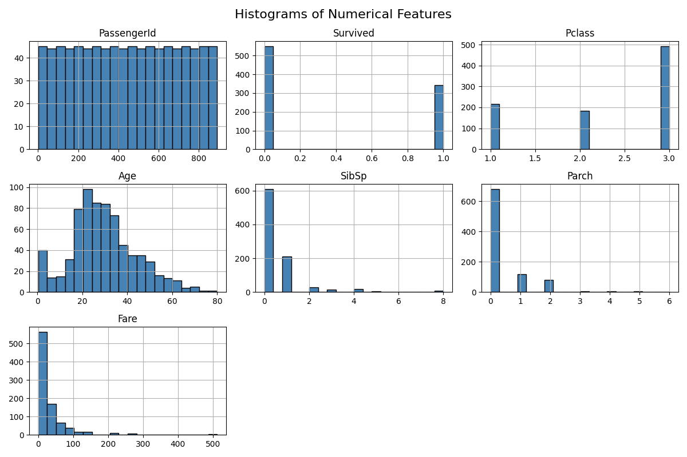
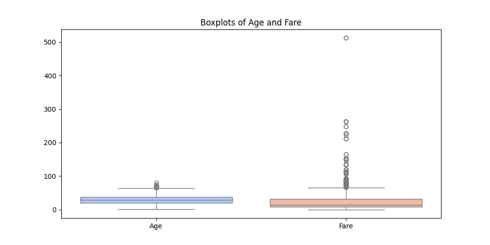
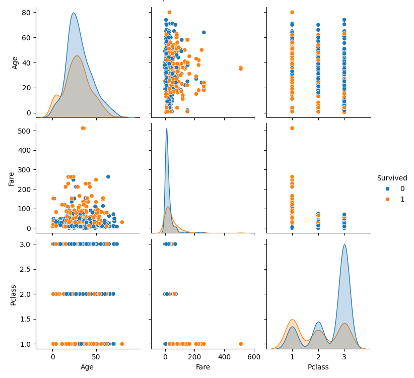
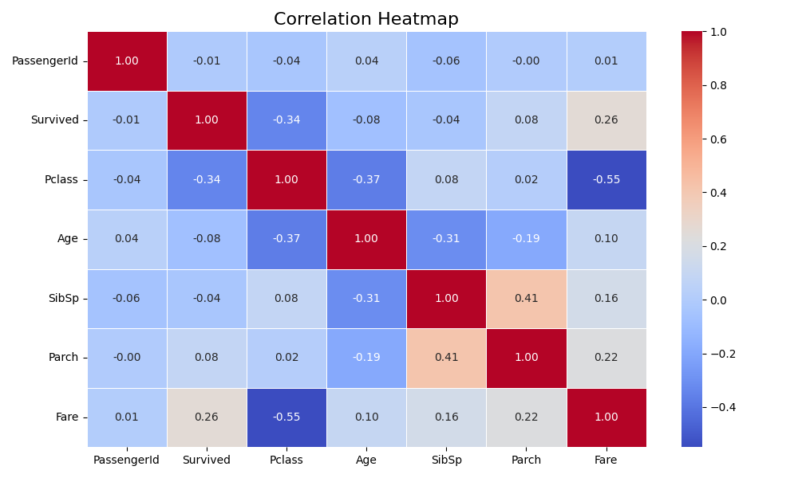

# 📊 EDA on Cleaned Titanic Dataset

This project is part of my internship task focused on analyzing the **cleaned Titanic dataset** using exploratory data analysis (EDA). The goal is to understand patterns and correlations that influence passenger survival.

---

## 📁 Dataset Used

- **File:** `Cleaned_Titanic.csv`
- **Cleaning Summary:**
  - Missing values handled (`Age`, `Embarked`)
  - `Cabin` dropped due to excessive nulls
  - Categorical features one-hot encoded (`Sex`, `Embarked`)
  - Numerical columns (`Age`, `Fare`) scaled using `StandardScaler`

---

## 🔍 Exploratory Data Analysis (EDA)

### ✅ Analysis Performed

- Summary statistics using `.info()`, `.describe()`
- Missing value confirmation
- Categorical value distribution
- Correlation insights

### 📈 Visualizations Included

#### 🔹 Histogram of All Numerical Features


#### 🔹 Boxplots for Age and Fare


#### 🔹 Pairplot for Age, Fare, Pclass, Survived


#### 🔹 Correlation Heatmap



## 🧠 Key Observations

- ✅ No missing values remain — dataset is modeling-ready
- 💰 `Fare` positively correlates with survival
- 🚆 `Pclass` negatively correlates with survival
- 👤 `Sex_male` is strongly related to survival (females more likely to survive)
- 🧮 Low multicollinearity — ideal for ML

---

## 🛠️ Tech Stack

- Python 3.9+
- Jupyter Notebook
- Libraries: `pandas`, `matplotlib`, `seaborn`, `scikit-learn`

---

## 📁 Project Structure

```
task-2-titanic-cleaned-eda/
├── Cleaned_Titanic.csv
├── Cleaned_Titanic_EDA.ipynb
├── cleaned-histograms.png
├── cleaned-boxplots.png
├── cleaned-pairplot.png
├── cleaned-correlation-heatmap.png
└── README.md
```

---

## 🚀 Next Steps

This cleaned dataset will be used in the next task to build and evaluate machine learning models for predicting passenger survival.

---

## 🔗 Connect with Me

**Manish Kumar Srivastav**  
📧 [Mail](msrivastavmanish@gmail.com)  
💼 [LinkedIn](https://www.linkedin.com/in/manish-kumar-srivastav)  
🐙 [GitHub](https://github.com/Roxtop07)

---
